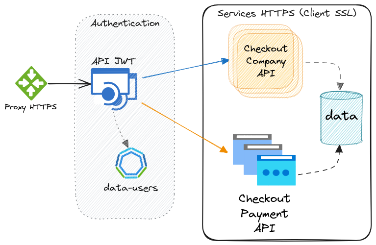

# checkout-api

API integradora de sistema de sesione de checkout.

Permite exponer los servicios provistos por los sistemas involucrados como solución de **Sesiones de Checkout**.

* [API de sistema de configuración checkout para empresas](https://github.com/janusky/checkout-company-api)
* [API de pagos de una sesión de checkout](https://github.com/janusky/checkout-payment-api)

## Objetivos

Exponer públicamente los servicios de modo seguro utilizando autenticación de usuarios de los sistemas.

Servicios de la API

* API de creación/modificación de sesiones de checkout para empresas.
* API de creación/pago de una sesión de checkout para clientes.

## Identificación de arquitectura

Proxy que permite balancear la carga y configurar certificados públicos.
>En principio Nginx pero podría ser un Api Gateway.

Autenticación de usuarios utilizando mecanismo de Json Web Token
>Se utiliza un modelo de datos optimizado para el acceso recurrente de los usuarios (H2).

Servicio [checkout-payment-api](https://github.com/janusky/checkout-payment-api) con programación reactiva [Spring Boot WebFlux](https://docs.spring.io/spring/docs/current/spring-framework-reference/web-reactive.html) y servidor [Reactor Netty](https://projectreactor.io/docs/netty/snapshot/reference/index.html).
>La ejecución reactiva permite alta performance para satisfacer la demanda de muchos procesos de pagos.  
>Requiere autenticación por certificados SSL

Servicio [checkout-company-api](https://github.com/janusky/checkout-company-api) provisto para un público más reducido.
>Se desarrolla de modo simple porque los requerimientos de performance no aplican.
>Requiere autenticación por certificados SSL



### Requisitos

* Bajo Mantenimiento
* Escalamiento

### Porque de los productos

Los servicios deben desarrollarse como Microservicios.

* Servicios pequeños e independientes (principio de responsabilidad única).
* Unidades de despliegue pequeñas.
* Reducción de tiempo de desarrollo.
* Agilidad en hot fixes (consecuencia de las anteriores).
* Multitecnología.
* Fácil escalado horizontal.

Implementación

* Microservicios: Aplicaciones Java idealmente con OpenAPI para documentar y definirAPI.
* Config Server: Centralizar y delegar en un servicio la provisión de la configuración de todos los microservicios.
* Load Balancer: Consumir un servicio de forma balanceada entre varias instancias desplegadas del mismo.
* Circuit breaker: Mecanismo de tolerancia a fallos.
* Gestión de Logs: TODO

Patrones utilizados

* [State](https://refactoring.guru/es/design-patterns/state/java/example)
* [Database Per Service](https://docs.aws.amazon.com/es_es/prescriptive-guidance/latest/modernization-data-persistence/database-per-service.html)
* [API Composition] (https://docs.aws.amazon.com/es_es/prescriptive-guidance/latest/modernization-data-persistence/api-composition.html)

## Contenido

- Sesión con JWT y Roles (package `security`)
- Documentación con OpenAPI 3
- Cache en servicios
- Registro de log con ticked id para errores
- Persistencia en modelo relacional (JPA)
- Auditoría con @EnableJpaAuditing (package `audit`)

### Directorios

1. `/src/` contiene el código fuente del backend
1. `/config/` contiene las plantillas de los archivos de configuración para los distintos ambientes
1. `/checkout-payment-api/` contiene archivos de configuración para servicios de aplicación [checkout-payment-api](https://github.com/janusky/checkout-payment-api)

### Tecnologías

- Java 17
- [Spring Boot 3](https://spring.io/blog/2022/05/24/preparing-for-spring-boot-3-0) (Security, Web, JPA, Cache)
- Json Web Tokens (JWT)
- H2 or Postgres (database)
- [Maven 3](https://maven.apache.org/)
- [Lombok](https://projectlombok.org)
- [OpenAPI 3](https://spec.openapis.org/oas/v3.1.0)

## Uso

Servicios en despliegue

- ̣~~(1) Nginx Proxy~~ TODO
- (1) Backend API Java-based checkout-api
- (1) Backend API Java-based checkout-payment-api
- ~~(1) Backend API Java-based checkout-company-api~~ TODO
- (1) PostgreSQL databases

Ejecutar utilizado Docker Compose

* [Run Development](DEV.md#run)

```sh
# Descargar la versión deseada (por ejemplo: `master`)
git clone https://github.com/janusky/checkout-api.git

# Docker Compose
docker-compose up -d
```

Obtener un token de sesión

```sh
curl -X POST "http://localhost:8081/auth/login" -H 'Content-Type: application/json' -d'
{
  "usernameOrEmail": "admin",
  "password": "admin"
}'
```

Acceder a la interface de OpenApi para probar los servicios expuestos

* http://localhost:8081/api-docs/swagger-ui/index.html

## Documentos

1. [Guía de desarrollo](DEV.md)
1. [Modificaciones a realizar](TODO.md)
1. ~~[Instructivo de instalación](INSTALL.md)~~
